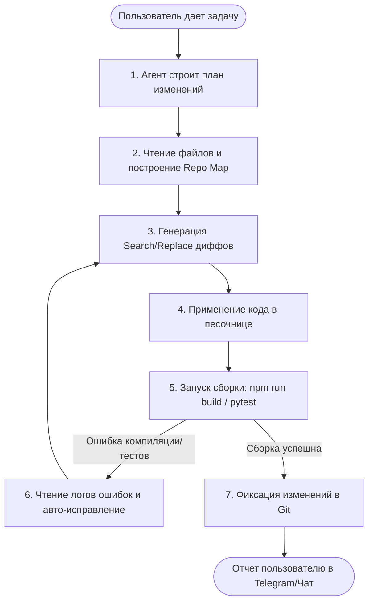

# Архитектурный дизайн: Самосовершенствующийся Агент (Self-Improving Agent Loop)

Этот документ описывает концепцию и шаги по реализации автономного контура самокодинга и самоотладки для **Home Agent**. Цель — позволить локальному ИИ-агенту самостоятельно писать новые фичи, чинить баги и развивать собственный код.

---

## 1. Заимствование концепций из Open Source

Для реализации контура мы не пишем всё с нуля, а опираемся на проверенные open-source архитектуры:

*   **Aider**:
    *   *Unified Diff / Search-Replace блоки*: Агент присылает компактные изменения (блоки кода до и после правки), вместо того чтобы генерировать файл целиком. Это экономит токены и ускоряет работу локальной LLM.
    *   *Repository Map*: Автоматически генерируемая сжатая текстовая карта кодовой базы (на основе ctags), позволяющая агенту понимать связи между файлами без необходимости считывать весь проект.
*   **OpenHands (OpenDevin) / SWE-agent**:
    *   *Изолированная песочница*: Выполнение команд сборки, тестирования и миграций внутри Docker-контейнера для предотвращения повреждения хост-системы.
    *   *ACI (Agent-Computer Interface)*: Упрощенные команды терминала для поиска по файлам и навигации, адаптированные для LLM.
*   **LangGraph / Smolagents**:
    *   *Цикл рассуждений*: Stateful-граф для управления состояниями агента, сохранением истории размышлений и пошаговым восстановлением после ошибок компиляции.

---

## 2. Схема автономного цикла (Loop)

---

## 3. Этапы реализации

### Этап 1: Инструменты редактирования (Backend API)
*   Реализация эндпоинтов для чтения структуры папок, поиска по тексту (ripgrep) и внесения диффов в файлы.
*   Сборка структуры "Repository Map" для кодовой базы Home Agent.

### Этап 2: Песочница исполнения (Sandbox)
*   Настройка легкого Docker-контейнера, монтирующего кодовую базу в режиме разработки.
*   Реализация запуска тестов (`pytest`) и компиляции фронтенда (`npm run build`) с перехватом вывода ошибок.

### Этап 3: Цикл самоотладки (Reasoning Loop)
*   Написание агента на базе LangGraph или Smolagents, который умеет делать запросы к Ollama, анализировать логи ошибок и переписывать код в случае сбоев сборки.

### Этап 4: Веб-интерфейс управления
*   Создание вкладки «Эволюция» (или «System») на дашборде, где в реальном времени отображается лог мыслей агента, измененные файлы и статус компиляции.
