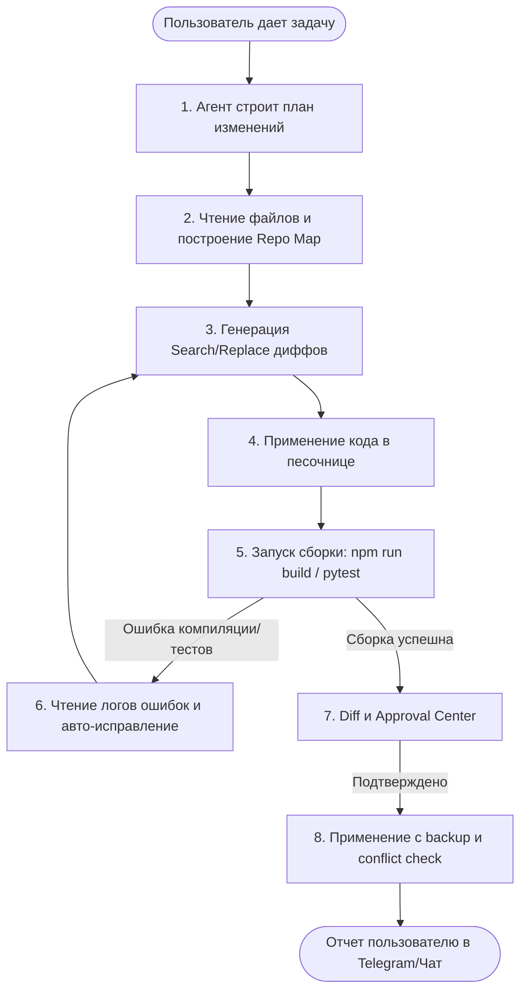

# Архитектурный дизайн: Самосовершенствующийся Агент (Self-Improving Agent Loop)

> **Статус на 2026-07-31:** реализован MVP bounded Code Sandbox с Docker
> runner, diff/baseline, конфликтной проверкой, резервной копией и двухшаговым
> approval-gated применением в основной проект. Автоматический PR и более
> глубокий evaluation loop остаются будущими слоями. Детали: [CODE_SANDBOX.md](CODE_SANDBOX.md).

Этот документ описывает концепцию и шаги по реализации автономного контура самокодинга и самоотладки для **Mira**. Цель — позволить локальному ИИ-агенту самостоятельно писать новые фичи, чинить баги и развивать собственный код.

## Идеи, которые сохраняем из Waku Agent

Waku Agent полезен для нас как компактный reference-проект, а не как шаблон
для копирования. Его четыре сильные идеи добавлены в roadmap Mira:

1. **Retrieval Gate** — перед обращением к памяти отдельное дешёвое решение
   определяет, нужна ли память этому запросу. Ошибка gate должна приводить к
   поиску, а не к потере полезного контекста.
2. **Procedural Memory / Skills** — persona и повторяемые рабочие сценарии
   хранятся отдельно от фактов и подключаются по задаче.
3. **Deterministic Eval + Release Gate** — проверка того, вызван ли правильный
   tool, не смешивается с субъективной оценкой качества ответа; итог gate
   сохраняется в историю.
4. **Per-turn Trace** — каждый проход должен показывать решение памяти,
   итерации loop, вызванные tools, latency и оценку token/cost.

Источник идей: [ShenSeanChen/waku-agent](https://github.com/ShenSeanChen/waku-agent),
в частности его [retrieval gate](https://github.com/ShenSeanChen/waku-agent/blob/main/waku/memory/retrieval_gate.py),
[loop](https://github.com/ShenSeanChen/waku-agent/blob/main/waku/loop/agent.py) и
[release gate](https://github.com/ShenSeanChen/waku-agent/blob/main/waku/ops/release_gate.py).
Мы сохраняем локальность и прозрачность, но оставляем собственные доменные
модули, Approval Center и Docker Sandbox.

---

## 1. Заимствование концепций из Open Source

Для реализации контура мы не пишем всё с нуля, а опираемся на проверенные open-source архитектуры:

*   **Aider**:
    *   *Unified Diff / Search-Replace блоки*: Агент присылает компактные изменения (блоки кода до и после правки), вместо того чтобы генерировать файл целиком. Это экономит токены и ускоряет работу локальной LLM.
    *   *Repository Map*: Автоматически генерируемая сжатая текстовая карта кодовой базы (на основе ctags), позволяющая агенту понимать связи между файлами без необходимости считывать весь проект.
*   **OpenHands (OpenDevin) / SWE-agent**:
    *   *Изолированная песочница*: Выполнение команд сборки, тестирования и миграций внутри Docker-контейнера для предотвращения повреждения хост-системы.
    *   *ACI (Agent-Computer Interface)*: Упрощенные команды терминала для поиска по файлам и навигации, адаптированные для LLM.
*   **LangGraph / Smolagents**:
    *   *Цикл рассуждений*: Stateful-граф для управления состояниями агента, сохранением истории размышлений и пошаговым восстановлением после ошибок компиляции.

---

## 2. Схема автономного цикла (Loop)

---

## 3. Этапы реализации

### Этап 1: Инструменты редактирования (Backend API)
*   Реализация эндпоинтов для чтения структуры папок, поиска по тексту (ripgrep) и внесения диффов в файлы.
*   Сборка структуры "Repository Map" для кодовой базы Mira.

### Этап 2: Песочница исполнения (Sandbox)
*   Настройка легкого Docker-контейнера, монтирующего кодовую базу в режиме разработки.
*   Реализация запуска тестов (`pytest`) и компиляции фронтенда (`npm run build`) с перехватом вывода ошибок.

### Этап 3: Цикл самоотладки (Reasoning Loop)
*   Написание агента на базе LangGraph или Smolagents, который умеет делать запросы к Ollama, анализировать логи ошибок и переписывать код в случае сбоев сборки.

### Этап 4: Веб-интерфейс управления
*   Вкладка `/sandbox` уже показывает workspace, Docker runtime, проверки, diff,
    baseline и запрос применения в Центр подтверждений.
*   Следующий слой — история sandbox-задач, richer test evidence и capability
    tokens; production Git commit/PR остаётся отдельным явно управляемым действием.
